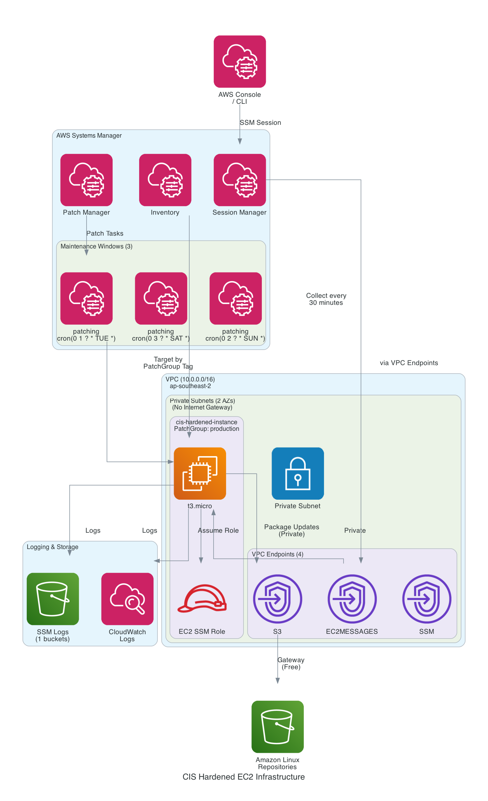

# CIS Hardened EC2 Infrastructure with SSM

Production-ready, secure EC2 infrastructure with automated patching via AWS Systems Manager.

## Architecture



*Last updated: 2025-12-06 06:02:55 UTC*

### Infrastructure Overview

| Resource Type | Count | Details |
|---------------|-------|---------|
| VPC | 1 | 10.0.0.0/16 |
| Subnets | 2 | Private only |
| EC2 Instances | 1 | See details below |
| VPC Endpoints | 4 | ec2messages, s3, ssm |
| Maintenance Windows | 3 | Tag-based patching |
| S3 Buckets | 1 | Encrypted logs |
| NAT Gateway | No | Cost savings |
| Internet Gateway | No | Private only |

## Infrastructure Overview

| Resource Type | Count | Details |
|---------------|-------|---------|
| VPC | 1 | 10.0.0.0/16 |
| Subnets | 2 | Private only |
| EC2 Instances | 1 | See details below |
| VPC Endpoints | 4 | ec2messages, s3, ssm |
| Maintenance Windows | 3 | Tag-based patching |
| S3 Buckets | 1 | Encrypted logs |
| NAT Gateway | No | Cost savings |
| Internet Gateway | No | Private only |

## Infrastructure Overview

| Resource Type | Count | Details |
|---------------|-------|---------|
| VPC | 1 | 10.0.0.0/16 |
| Subnets | 2 | Private only |
| EC2 Instances | 1 | See details below |
| VPC Endpoints | 4 | ec2messages, s3, ssm |
| Maintenance Windows | 3 | Tag-based patching |
| S3 Buckets | 1 | Encrypted logs |
| NAT Gateway | No | Cost savings |
| Internet Gateway | No | Private only |

## Key Features

- **Secure Access**: SSM Session Manager (no SSH, no bastion)
- **Automated Patching**: Tag-based maintenance windows
- **Cost Optimized**: No NAT Gateway (~$36/month vs $85/month)
- **Private Networking**: VPC endpoints for AWS services
- **Encrypted**: EBS volumes and S3 logs
- **Compliant**: IMDSv2 enforced, security groups locked down

## Quick Start

### Prerequisites

```bash
# Install required tools
brew install terraform awscli

# Configure AWS credentials
aws configure
# Set region to: ap-southeast-2
```

### Deploy

```bash
# Initialize Terraform
terraform init

# Review plan
terraform plan

# Deploy infrastructure
terraform apply
```

### Connect to Instance

```bash
# Install Session Manager plugin
brew install --cask session-manager-plugin

# Connect via SSM
aws ssm start-session --target <instance-id> --region ap-southeast-2
```

## Architecture Components

### Networking
- **VPC**: 10.0.0.0/16 across 2 AZs
- **Public Subnets**: 10.0.1.0/24, 10.0.2.0/24
- **Private Subnets**: 10.0.101.0/24, 10.0.102.0/24
- **VPC Endpoints**: SSM, SSMMessages, EC2Messages (Interface)
- **S3 Gateway Endpoint**: Free access to Amazon repos

### Compute
- **Instance Type**: t3.micro (configurable)
- **OS**: Amazon Linux 2023
- **Storage**: 30GB gp3 encrypted
- **Security**: IMDSv2 enforced, no public IP

### Patching (Tag-Based)

Three maintenance windows controlled by `PatchGroup` tag:

| Environment | Schedule | Approval Days | Reboot |
|-------------|----------|---------------|--------|
| Production | Sun 2AM | 7 days | RebootIfNeeded |
| Development | Sat 3AM | 3 days | RebootIfNeeded |
| Critical | Tue 1AM | 14 days | NoReboot |

**Change patch group:**
```bash
aws ec2 create-tags --resources i-xxxxx \
  --tags Key=PatchGroup,Value=development
```

### Monitoring & Logging
- **CloudWatch Logs**: Real-time patching output
- **S3 Logs**: 30-day retention, encrypted
- **SSM Inventory**: Collected every 30 minutes
- **Patch Compliance**: Daily scans

## Cost Breakdown

*Estimated monthly costs for Sydney (ap-southeast-2) region*

### Cost Summary by Category

| Category | Monthly Cost | % of Total |
|----------|--------------|------------|
| **Storage** | $0.08 | 0.3% |
| **Networking** | $21.95 | 98.4% |
| **Monitoring** | $0.28 | 1.3% |
| **TOTAL** | **$22.30** | **100%** |

### Detailed Cost Breakdown

| Category | Resource | Details | Hourly | Monthly | Annual |
|----------|----------|---------|--------|---------|--------|
| **Storage** | S3 Bucket 1: Storage | ~1.0GB logs | $0.0000 | $0.03 | $0.30 |
|  | S3 Bucket 1: Requests | ~10k PUT/GET | $0.0001 | $0.05 | $0.60 |
| **Networking** | VPC Endpoint: EC2MESSAGES | Interface endpoint (730 hrs) | $0.0100 | $7.30 | $87.60 |
|  | VPC Endpoint: SSM | Interface endpoint (730 hrs) | $0.0100 | $7.30 | $87.60 |
|  | VPC Endpoint: SSMMESSAGES | Interface endpoint (730 hrs) | $0.0100 | $7.30 | $87.60 |
|  | VPC Endpoint Data: EC2MESSAGES | ~1.7GB/month | $0.0000 | $0.02 | $0.20 |
|  | VPC Endpoint Data: SSM | ~1.7GB/month | $0.0000 | $0.02 | $0.20 |
|  | VPC Endpoint Data: SSMMESSAGES | ~1.7GB/month | $0.0000 | $0.02 | $0.20 |
| **Monitoring** | CloudWatch Logs 1: Ingestion | ~167MB | $0.0001 | $0.08 | $1.00 |
|  | CloudWatch Logs 1: Storage | ~333MB | $0.0000 | $0.01 | $0.12 |
|  | CloudWatch Logs 2: Ingestion | ~167MB | $0.0001 | $0.08 | $1.00 |
|  | CloudWatch Logs 2: Storage | ~333MB | $0.0000 | $0.01 | $0.12 |
|  | CloudWatch Logs 3: Ingestion | ~167MB | $0.0001 | $0.08 | $1.00 |
|  | CloudWatch Logs 3: Storage | ~333MB | $0.0000 | $0.01 | $0.12 |
| | **TOTAL** | | | **$22.30** | **$267.66** |

**Annual Cost: $267.66**

### Free AWS Services Included

The following services are included at **no additional cost**:

| Service | Usage | Value |
|---------|-------|-------|
| SSM Session Manager | Unlimited sessions | Replaces bastion host (~$10/month) |
| SSM Patch Manager | Automated patching | Replaces manual patching time |
| SSM Inventory | Resource tracking | Replaces third-party tools |
| SSM Maintenance Windows | Scheduled tasks | Built-in automation |
| S3 Gateway Endpoint | Package downloads | Replaces NAT data charges |

### Cost Optimization

Current configuration saves **~$48/month** by:
- ❌ No NAT Gateway (-$48.18/month)
- ✅ VPC Endpoints for AWS services
- ✅ S3 Gateway Endpoint (free) for package repos
- ✅ Private subnets only (no public IPs)

See [COST-ESTIMATE.md](COST-ESTIMATE.md) for detailed optimization options.

## Cost Summary by Category

| Category | Monthly Cost | % of Total |
|----------|--------------|------------|
| **Storage** | $0.08 | 0.3% |
| **Networking** | $21.95 | 98.4% |
| **Monitoring** | $0.28 | 1.3% |
| **TOTAL** | **$22.30** | **100%** |

### Detailed Cost Breakdown

| Category | Resource | Details | Hourly | Monthly | Annual |
|----------|----------|---------|--------|---------|--------|
| **Storage** | S3 Bucket 1: Storage | ~1.0GB logs | $0.0000 | $0.03 | $0.30 |
|  | S3 Bucket 1: Requests | ~10k PUT/GET | $0.0001 | $0.05 | $0.60 |
| **Networking** | VPC Endpoint: EC2MESSAGES | Interface endpoint (730 hrs) | $0.0100 | $7.30 | $87.60 |
|  | VPC Endpoint: SSM | Interface endpoint (730 hrs) | $0.0100 | $7.30 | $87.60 |
|  | VPC Endpoint: SSMMESSAGES | Interface endpoint (730 hrs) | $0.0100 | $7.30 | $87.60 |
|  | VPC Endpoint Data: EC2MESSAGES | ~1.7GB/month | $0.0000 | $0.02 | $0.20 |
|  | VPC Endpoint Data: SSM | ~1.7GB/month | $0.0000 | $0.02 | $0.20 |
|  | VPC Endpoint Data: SSMMESSAGES | ~1.7GB/month | $0.0000 | $0.02 | $0.20 |
| **Monitoring** | CloudWatch Logs 1: Ingestion | ~167MB | $0.0001 | $0.08 | $1.00 |
|  | CloudWatch Logs 1: Storage | ~333MB | $0.0000 | $0.01 | $0.12 |
|  | CloudWatch Logs 2: Ingestion | ~167MB | $0.0001 | $0.08 | $1.00 |
|  | CloudWatch Logs 2: Storage | ~333MB | $0.0000 | $0.01 | $0.12 |
|  | CloudWatch Logs 3: Ingestion | ~167MB | $0.0001 | $0.08 | $1.00 |
|  | CloudWatch Logs 3: Storage | ~333MB | $0.0000 | $0.01 | $0.12 |
| | **TOTAL** | | | **$22.30** | **$267.66** |

**Annual Cost: $267.66**

### Free AWS Services Included

The following services are included at **no additional cost**:

| Service | Usage | Value |
|---------|-------|-------|
| SSM Session Manager | Unlimited sessions | Replaces bastion host (~$10/month) |
| SSM Patch Manager | Automated patching | Replaces manual patching time |
| SSM Inventory | Resource tracking | Replaces third-party tools |
| SSM Maintenance Windows | Scheduled tasks | Built-in automation |
| S3 Gateway Endpoint | Package downloads | Replaces NAT data charges |

### Cost Optimization

Current configuration saves **~$48/month** by:
- ❌ No NAT Gateway (-$48.18/month)
- ✅ VPC Endpoints for AWS services
- ✅ S3 Gateway Endpoint (free) for package repos
- ✅ Private subnets only (no public IPs)

See [COST-ESTIMATE.md](COST-ESTIMATE.md) for detailed optimization options.

## Storage
| Service | Details | Monthly Cost |
|---------|---------|--------------|
| S3 Storage (1 buckets) | ~1GB logs | **$0.03** |
| S3 Requests | ~10k PUT/GET | **$0.05** |

### Networking
| Service | Details | Monthly Cost |
|---------|---------|--------------|
| VPC Endpoints (4x) | ec2messages, s3, ssm, ssmmessages | **$29.20** |
| VPC Endpoint Data | ~5GB/month | **$0.05** |

### Monitoring
| Service | Details | Monthly Cost |
|---------|---------|--------------|
| CloudWatch Logs Ingestion | ~500MB | **$0.25** |
| CloudWatch Logs Storage | ~1GB | **$0.03** |

### Total Monthly Cost: **$29.61**

**Annual Cost: $355.26**

### Cost Optimization

Current configuration saves **~$48/month** by:
- ❌ No NAT Gateway
- ✅ VPC Endpoints for AWS services
- ✅ S3 Gateway Endpoint (free) for package repos

See [COST-ESTIMATE.md](COST-ESTIMATE.md) for detailed optimization options.

## File Structure

```
.
├── provider.tf              # Terraform & AWS provider config
├── variables.tf             # All configurable variables
├── data.tf                  # Data sources (AMI lookup)
├── networking.tf            # VPC, subnets, endpoints, security groups
├── iam.tf                   # IAM roles for EC2
├── ssm-iam.tf              # IAM roles for SSM maintenance
├── instances.tf             # EC2 instance configuration
├── ssm-maintenance-windows.tf  # Maintenance windows & patch baselines
├── ssm-inventory.tf         # Inventory & patch scanning
├── ssm-storage.tf           # S3 bucket for logs
├── outputs.tf               # Output values
└── README-PATCHING.md       # Detailed patching guide
```

## Customization

### Change Instance Type

Edit `variables.tf`:
```hcl
variable "instance_type" {
  default = "t3.small"  # or t3.medium, etc.
}
```

### Change Patch Schedule

Edit `variables.tf` maintenance_windows:
```hcl
production = {
  schedule = "cron(0 3 ? * SUN *)"  # Change to 3 AM
  # ...
}
```

### Add More Instances

Just deploy more with different `PatchGroup` tags - they'll automatically join the right maintenance window.

## Operations

### Manual Patch Scan
```bash
aws ssm send-command \
  --document-name "AWS-RunPatchBaseline" \
  --targets "Key=tag:PatchGroup,Values=production" \
  --parameters "Operation=Scan" \
  --region ap-southeast-2
```

### View Patch Compliance
```bash
aws ssm describe-instance-patch-states \
  --instance-ids <instance-id> \
  --region ap-southeast-2
```

### View Logs
```bash
# CloudWatch Logs
aws logs tail /aws/ssm/maintenance-windows/cis-hardened/production --follow

# S3 Logs
aws s3 ls s3://cis-hardened-ssm-logs-<account-id>/maintenance-windows/
```

## Generate Architecture Diagram

The diagram is automatically generated from your Terraform state:

```bash
# Install dependencies
pip3 install diagrams graphviz
brew install graphviz

# Generate diagram from current Terraform state
python3 generate_diagram_dynamic.py
```

This creates:
- `architecture.png` - Visual diagram
- `architecture-metadata.json` - Resource inventory (version controlled)

The diagram updates automatically based on your actual deployed infrastructure!

## Security Features

- ✅ No SSH access (SSM only)
- ✅ No public IP addresses
- ✅ IMDSv2 enforced
- ✅ Encrypted EBS volumes
- ✅ Encrypted S3 logs
- ✅ Private subnets only
- ✅ VPC endpoints (no internet routing)
- ✅ Security groups locked to VPC CIDR
- ✅ IAM roles with least privilege

## Clean Up

```bash
terraform destroy
```

## Documentation

- [Cost Estimate](COST-ESTIMATE.md) - Detailed cost breakdown
- [Patching Guide](README-PATCHING.md) - SSM maintenance windows guide
- [EC2 Guide](README-EC2.md) - EC2 instance details

## Support

For issues or questions, check:
- [AWS Systems Manager Docs](https://docs.aws.amazon.com/systems-manager/)
- [Terraform AWS Provider](https://registry.terraform.io/providers/hashicorp/aws/latest/docs)

---

**Built with Terraform | Managed by AWS Systems Manager | Optimized for Cost**
